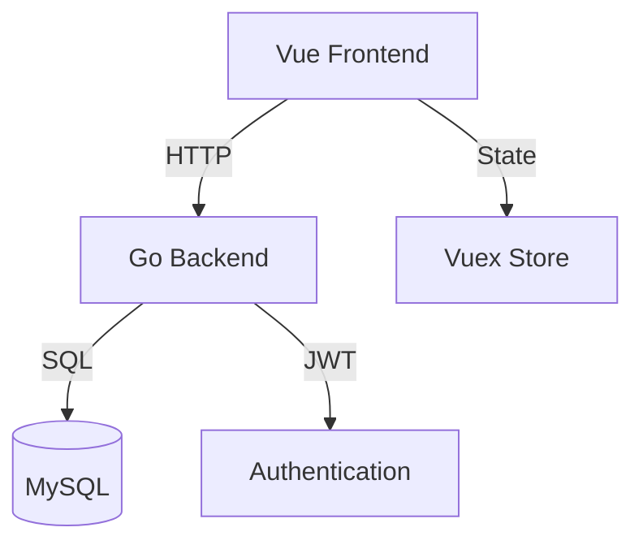

# User Management System

A Vue.js + Go web application with JWT authentication and role-based access control.

## 📚 Documentation Index

### Getting Started
- [Frontend Quick Start Guide](docs/FRONTEND_QUICKSTART.md) - Essential guide for DevOps engineers learning front-end
- [Contributing Guide](CONTRIBUTING.md) - Setup instructions and development workflow
- [Architecture Overview](docs/ARCHITECTURE.md) - System design and component interactions

### API & Security
- [API Documentation](docs/API.md) - Complete API reference
- [API Examples](docs/API_EXAMPLES.md) - Real-world request/response examples
- [Security Overview](docs/SECURITY.md) - Security implementations and considerations

### Project Status
- [TODO List](TODO.md) - Current project status and planned improvements

## 🚀 Quick Start

### Prerequisites
- Go 1.x
- Node.js 16+
- MySQL 8.0+
- Docker (optional)

### Development Setup

1. Clone the repository:
```bash
git clone https://github.com/your-username/mospolytech-web-app.git
cd mospolytech-web-app
```

2. Set up environment:
```bash
cp .env.example .env
# Edit .env with your configurations
```

3. Start the backend:
```bash
cd server
go mod download
go run main.go
```

4. Start the frontend:
```bash
cd client
npm install
npm run dev
```

Visit http://localhost:8087 to see the application.

## 🔑 Key Features

- JWT-based authentication
- Role-based access control
- Dark mode support
- Responsive design
- Error boundaries
- Form validation
- Loading states
- Secure session management

## 🏗️ Technology Stack

### Frontend
- Vue 3
- Vuex
- Vue Router
- TailwindCSS
- Vite

### Backend
- Go
- Gin
- JWT
- MySQL
- SQLC

## 📊 Architecture Overview



## 🔒 Security Features

- HTTP-only cookies for JWT
- CSRF protection
- XSS prevention
- Input validation
- Error handling
- Role-based access
- Secure headers

## 🛠️ Development Tools

### Recommended VSCode Extensions
- Volar (Vue 3)
- Go
- SQLTools
- Docker
- Markdown Preview

### Browser Extensions
- Vue.js devtools
- React Developer Tools
- Redux DevTools

## 📝 Development Notes

### Common Tasks
1. Adding a new page:
   - Create component in `client/src/views/`
   - Add route in `client/src/routes.js`
   - Add navigation link in `NavBar.vue`

2. Adding an API endpoint:
   - Create handler in `server/middleware/`
   - Add route in `server/main.go`
   - Document in `docs/API.md`

### Best Practices
- Follow Vue.js style guide
- Use TypeScript for new components
- Write documentation for API changes
- Test in both light and dark modes
- Validate form inputs
- Handle loading and error states

## 🤝 Contributing

See [CONTRIBUTING.md](CONTRIBUTING.md) for detailed development guidelines.

## 📋 TODO

See [TODO.md](TODO.md) for current project status and planned improvements.

## 📜 License

This project is licensed under the MIT License - see the [LICENSE](LICENSE) file for details.