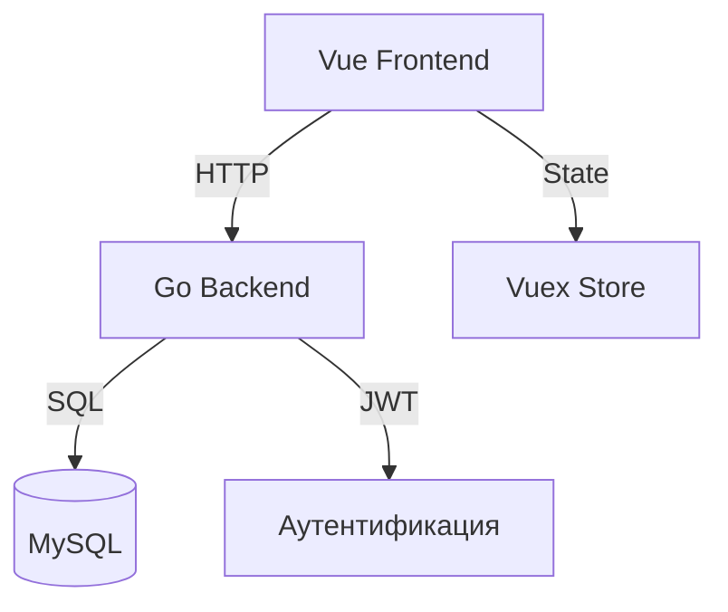

# Mospolytech-Web-App

Веб-приложение на Vue.js + Go с JWT-аутентификацией и контролем доступа на основе ролей. Является фундаментом для создания веб-приложений.

## 📚 Индекс документации

### Начало работы
- [Краткое руководство по Frontend](docs/FRONTEND_QUICKSTART.md) - Важное руководство для общего понимания Frontend'а
- [Руководство по внесению вклада](CONTRIBUTING.md) - Инструкции по настройке и процессу разработки
- [Обзор архитектуры](docs/ARCHITECTURE.md) - Дизайн системы и взаимодействие компонентов

### API и безопасность
- [Документация API](docs/API.md) - Полный справочник API
- [Примеры API](docs/API_EXAMPLES.md) - Примеры запросов и ответов из реального мира
- [Обзор безопасности](docs/SECURITY.md) - Реализации и соображения безопасности

### Статус проекта
- [Список TODO](TODO.md) - Текущий статус проекта и запланированные улучшения

## 🚀 Быстрый старт

### Предварительные требования
- Go 1.20+
- Node.js 16+
- MySQL 8.0+
- Docker (опционально)

### Настройка разработки

1. Клонируйте репозиторий:
```bash
git clone https://github.com/your-username/mospolytech-web-app.git
cd mospolytech-web-app
```

2. Настройте окружение:
```bash
cp .env.example .env
# Отредактируйте .env с вашими конфигурациями
```

3. Запустите бэкенд:
```bash
cd server
go mod download
go run main.go
```

4. Запустите фронтенд:
```bash
cd client
npm install
npm run dev
```

Приложение будет запущено на http://localhost:8087.

## 🔑 Ключевые особенности

- JWT-аутентификация
- Контроль доступа на основе ролей
- Поддержка темной темы
- Адаптивный дизайн
- Границы ошибок
- Валидация форм
- Состояния загрузки
- Безопасное управление сессиями

## 🏗️ Технологический стек

### Фронтенд
- Vue 3
- Vuex
- Vue Router
- TailwindCSS
- Vite

### Бэкенд
- Go
- Gin
- JWT
- MySQL
- SQLC

## 📊 Обзор архитектуры



## 🔒 Функции безопасности

- HTTP-only куки для JWT
- Защита от CSRF
- Предотвращение XSS
- Валидация ввода
- Обработка ошибок
- Доступ на основе ролей
- Безопасные заголовки

## 🛠️ Инструменты разработки

### Рекомендуемые расширения VSCode
- Volar (Vue 3)
- Go
- SQLTools
- Docker
- Markdown Preview

### Расширения браузера
- Vue.js devtools
- React Developer Tools
- Redux DevTools

## 📝 Заметки о разработке

### Общие задачи
1. Добавление новой страницы:
   - Создайте компонент в `client/src/views/`
   - Добавьте маршрут в `client/src/routes.js`
   - Добавьте ссылку навигации в `NavBar.vue`

2. Добавление новой конечной точки API:
   - Создайте обработчик в `server/middleware/`
   - Добавьте маршрут в `server/main.go`
   - Задокументируйте в `docs/API.md`

### Лучшие практики
- Следуйте руководству по стилю Vue.js
- Используйте TypeScript для новых компонентов
- Пишите документацию для изменений API
- Тестируйте в светлой и темной темах
- Валидируйте вводимые данные в формах
- Обрабатывайте состояния загрузки и ошибок

## 🤝 Внесение вклада

Смотрите [CONTRIBUTING.md](CONTRIBUTING.md) для получения подробных инструкций по разработке.

## 📋 TODO

Смотрите [TODO.md](TODO.md) для получения информации о текущем состоянии проекта и запланированных улучшениях.

## 📜 Лицензия

Этот проект лицензируется в соответствии с The Unlicense - смотрите файл [LICENSE](LICENSE) для получения подробной информации.