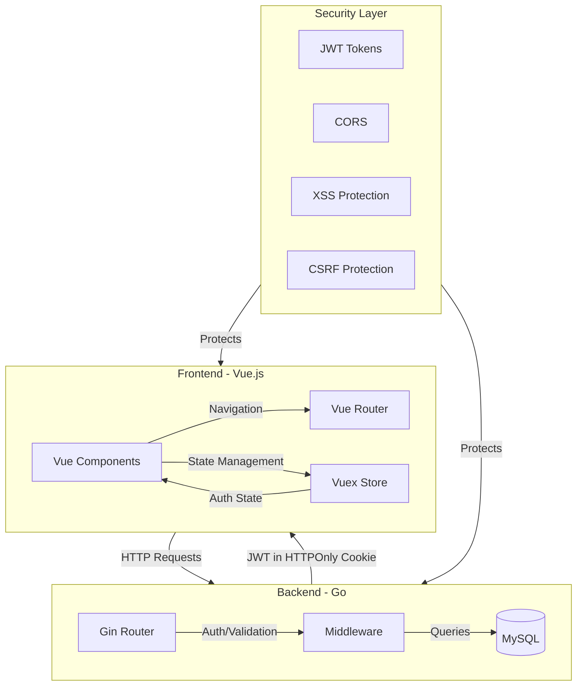
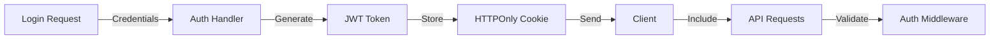
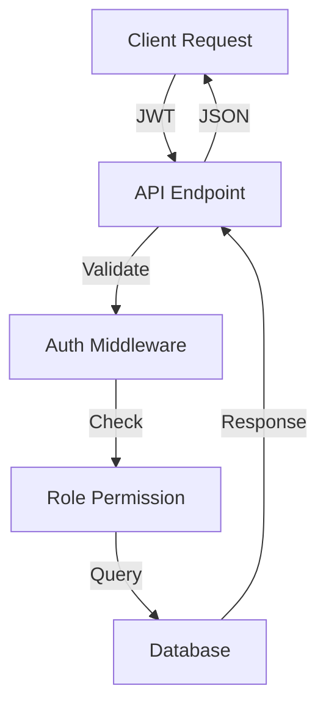

# System Architecture Overview



## Component Communication Flow

1. **Authentication Flow**
   ```mermaid
   sequenceDiagram
       participant User
       participant Frontend
       participant Backend
       participant Database
       
       User->>Frontend: Login Form
       Frontend->>Backend: POST /api/server/login
       Backend->>Database: Validate Credentials
       Database-->>Backend: User Details
       Backend->>Backend: Generate JWT
       Backend-->>Frontend: Set HTTPOnly Cookie
       Frontend->>Frontend: Update Vuex Store
       Frontend-->>User: Redirect to Home
   ```

2. **Protected Route Access**
   ```mermaid
   sequenceDiagram
       participant User
       participant Router
       participant Store
       participant Backend
       
       User->>Router: Access Admin Route
       Router->>Store: Check User Role
       Store->>Backend: Validate Token
       Backend-->>Store: Token Valid/Invalid
       Store-->>Router: Allow/Deny Access
       Router-->>User: Show Page/Redirect
   ```

## Key Technologies

### Frontend Stack
- **Vue 3**: Core framework
- **Vuex**: State management
- **Vue Router**: Client-side routing
- **TailwindCSS**: Utility-first styling
- **Vite**: Build tool and dev server

### Backend Stack
- **Go**: Core language
- **Gin**: Web framework
- **JWT**: Authentication
- **MySQL**: Database
- **SQLC**: Type-safe SQL

## Security Implementation

### Token Flow


### Data Flow


## Directory Structure Explained

```
mospolytech-web-app/
├── client/                 # Frontend Vue application
│   ├── src/
│   │   ├── components/     # Reusable Vue components
│   │   ├── views/         # Page components
│   │   ├── store/         # Vuex state management
│   │   └── routes.js      # Vue Router configuration
│   └── ...
├── server/                 # Backend Go application
│   ├── middleware/        # Request processing
│   ├── config/           # Application configuration
│   ├── db/              # Database management
│   └── ...
└── docs/                  # Documentation
    ├── API.md            # API specifications
    ├── SECURITY.md       # Security implementation
    └── API_EXAMPLES.md   # API usage examples
```

## DevOps Considerations

### Environment Variables
Located in `.env`:
```env
# Database Configuration
DB_USER=your_db_user
DB_PASSWORD=your_db_password
DB_HOST=localhost
DB_PORT=3306
DB_NAME=your_db_name

# JWT Configuration
JWT_SECRET=your_jwt_secret

# Server Configuration
SERVER_PORT=8086
CLIENT_PORT=8087
```

### Docker Configuration
The application is containerized with separate services:
- Frontend container (Vue)
- Backend container (Go)
- Database container (MySQL)

### Development Workflow
1. Local development with hot-reload
2. Testing in containerized environment
3. Production deployment with optimized builds

## Common Development Tasks

### Adding New Features
1. Create backend endpoint in `server/middleware/`
2. Add route in `server/main.go`
3. Create frontend component in `client/src/components/`
4. Add route in `client/src/routes.js`
5. Update documentation in `docs/`

### Security Updates
1. Update JWT configuration
2. Modify CORS settings
3. Add security headers
4. Update cookie settings
5. Document changes

This architecture overview should help you understand the system's components and their interactions. The mermaid diagrams provide a visual representation of the flows, making it easier to grasp the system's behavior.