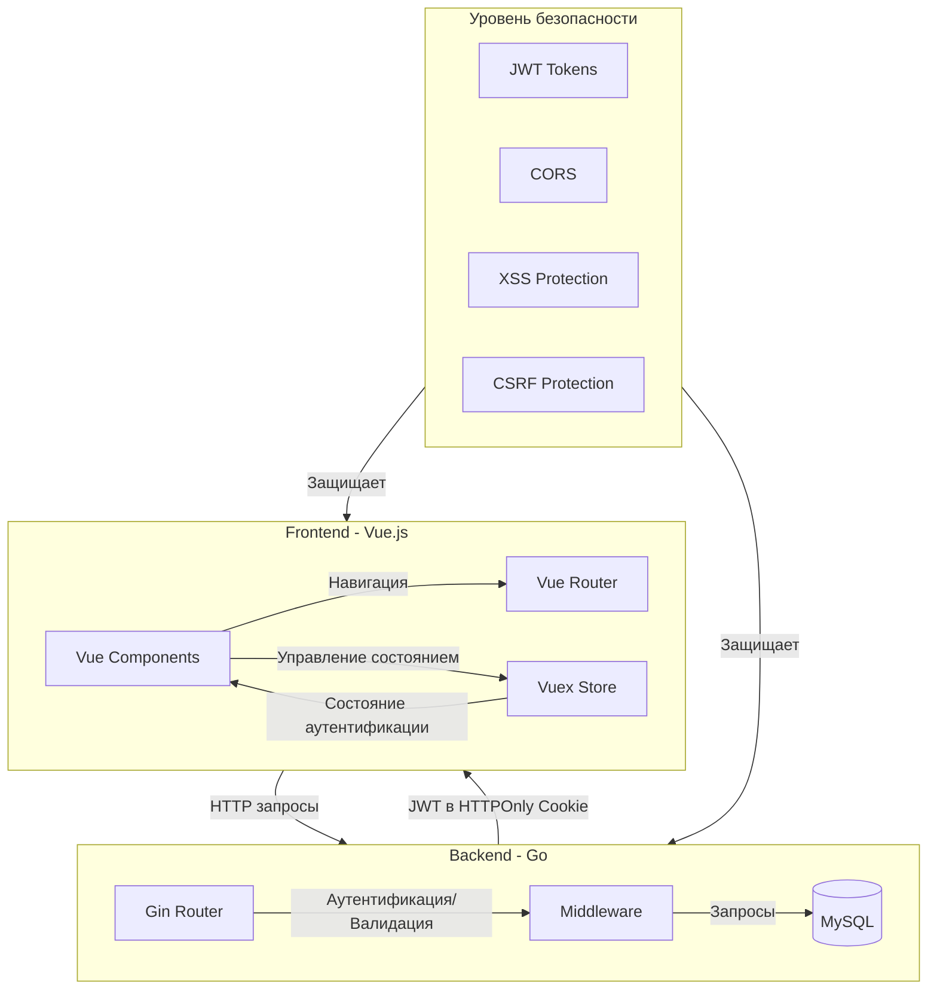
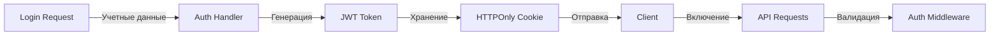
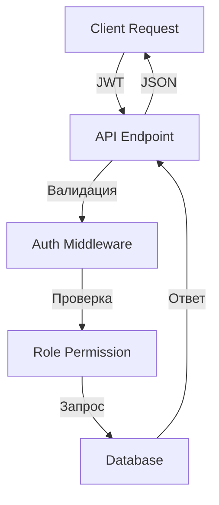

# Обзор архитектуры системы



## Схема взаимодействия компонентов

1. **Схема аутентификации**
   ```mermaid
   sequenceDiagram
       participant User
       participant Frontend
       participant Backend
       participant Database
       
       User->>Frontend: Форма логина
       Frontend->>Backend: POST /api/server/login
       Backend->>Database: Проверка учетных данных
       Database-->>Backend: Данные пользователя
       Backend->>Backend: Генерация JWT
       Backend-->>Frontend: Установка HTTPOnly Cookie
       Frontend->>Frontend: Обновление Vuex Store
       Frontend-->>User: Перенаправление на главную страницу
   ```

2. **Доступ к защищенным маршрутам**
   ```mermaid
   sequenceDiagram
       participant User
       participant Router
       participant Store
       participant Backend
       
       User->>Router: Доступ к Admin Route
       Router->>Store: Проверка роли пользователя
       Store->>Backend: Валидация токена
       Backend-->>Store: Токен действителен/недействителен
       Store-->>Router: Разрешить/Запретить доступ
       Router-->>User: Показать страницу/Перенаправить
   ```

## Ключевые технологии

### Frontend Stack
- **Vue 3**: Основной фреймворк
- **Vuex**: Управление состоянием
- **Vue Router**: Клиентская маршрутизация
- **TailwindCSS**: Утилитарные стили
- **Vite**: Инструмент сборки и dev-сервер

### Backend Stack
- **Go**: Основной язык
- **Gin**: Веб-фреймворк
- **JWT**: Аутентификация
- **MySQL**: База данных
- **SQLC**: Type-safe SQL

## Реализация безопасности

### Token Flow


### Data Flow


## Описание структуры каталогов

```
mospolytech-web-app/
├── client/                 # Frontend Vue приложение
│   ├── src/
│   │   ├── components/     # Переиспользуемые Vue компоненты
│   │   ├── views/         # Страницы
│   │   ├── store/         # Vuex управление состоянием
│   │   └── routes.js      # Vue Router конфигурация
│   └── ...
├── server/                 # Backend Go приложение
│   ├── middleware/        # Обработка запросов
│   ├── config/           # Конфигурация приложения
│   ├── db/              # Управление базой данных
│   └── ...
└── docs/                  # Документация
    ├── API.md            # Спецификации API
    ├── SECURITY.md       # Реализация безопасности
    └── API_EXAMPLES.md   # Примеры использования API
```

## DevOps соображения

### Переменные окружения
Находятся в `.env`:
```env
# Database Configuration
DB_USER=your_db_user
DB_PASSWORD=your_db_password
DB_HOST=localhost
DB_PORT=3306
DB_NAME=your_db_name

# JWT Configuration
JWT_SECRET=your_jwt_secret

# Server Configuration
SERVER_PORT=8086
CLIENT_PORT=8087
```

### Docker Configuration
Приложение контейнеризировано с разделением на сервисы:
- Frontend контейнер (Vue)
- Backend контейнер (Go)
- Database контейнер (MySQL)

### Development Workflow
1. Локальная разработка с hot-reload
2. Тестирование в контейнеризированном окружении
3. Production деплой с оптимизированными сборками

## Распространенные задачи разработки

### Добавление новых функций
1. Создать backend endpoint в `server/middleware/`
2. Добавить маршрут в `server/main.go`
3. Создать frontend компонент в `client/src/components/`
4. Добавить маршрут в `client/src/routes.js`
5. Обновить документацию в `docs/`

### Обновления безопасности
1. Обновить JWT конфигурацию
2. Изменить CORS настройки
3. Добавить заголовки безопасности
4. Обновить настройки cookie
5. Задокументировать изменения

Этот обзор архитектуры должен помочь вам понять компоненты системы и их взаимодействие. Mermaid диаграммы предоставляют визуальное представление потоков, облегчая понимание поведения системы.